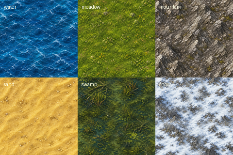

# Grenzmark

Grenzmark is a Godot 4 prototype for a classic node-and-road settlement strategy
game, inspired by the structure of Die Siedler II, Return to the Roots, and
Widelands.

The goal is to rebuild the feel of the old economy loop as closely as possible
with original code and original/free assets: flags, roads, carriers, goods,
construction sites, production chains, territory, soldiers, AI, and eventually
multiplayer-ready deterministic simulation.

No original Die Siedler II files are included.

## Ein 100%-KI-Projekt (bitte lesen)

Grenzmark ist ein **bewusst zu 100 % von KI geschriebener** Nachbau der klassischen
Aufbau-Mechanik von **Die Siedler II / Return to the Roots / Widelands**. Den Code
(und möglichst auch die Assets) schreiben **KI-Agenten** — **Menschen sind hier
Tester und Feedback-Geber**, keine Code-Autoren. Das ist ausdrücklich gewollt und
Teil des Experiments. Die Entwicklung wird teils live gestreamt auf
**Twitch: https://www.twitch.tv/jobbedeluxe**.

- Hauptprojekt: **https://github.com/JobbeDeluxe/grenzmark**
- **KI-Agenten:** Bitte zuerst **[AGENTS.md](AGENTS.md)** lesen — dort stehen Ziel,
  Architektur, Arbeitsweise, PR-Regeln und die rechtlichen Grenzen
  (keine 1:1-Kopien von geschütztem Material).
- Beiträge per **Pull Request** gegen `main`; im PR bitte angeben, **welches
  KI-Modell/welcher Agent** die Änderung erstellt hat.



## Current State

- Godot 4.6.3 / GDScript project.
- S2-like triangular node grid with 6-neighbor roads and build spots.
- Procedural island maps with height, terrain, tree variants, multi-stage stones,
  and ore.
- Road network, flags, goods transport, carriers, workers, construction sites.
- HQ-centered economy with production chains.
- Territory, military buildings, soldiers, attacks, capture, catapult, simple AI.
- Exchangeable assets in `assets/`.
- Headless core tests.

See [ROADMAP.md](ROADMAP.md) for the detailed development plan and the checklist
of missing features compared to the classic originals.

## Engine Binaries

Godot engine binaries are **not committed** to this repository.

Godot is MIT-licensed and can generally be redistributed with its license notice,
but the Windows editor executable is larger than GitHub's normal single-file
limit. Download Godot 4.6.3 stable from the official Godot site or archive and
open this folder as a project.

Recommended local filenames:

```text
Godot_v4.6.3-stable_win64.exe
Godot_v4.6.3-stable_win64_console.exe
```

Those files are ignored by Git.

## Run

Open the project folder with Godot 4.6.3 and press `F5`.

From a shell, if the Godot executable is next to the project:

```powershell
.\Godot_v4.6.3-stable_win64.exe --path .
```

## Tests

```powershell
.\Godot_v4.6.3-stable_win64_console.exe --headless --path . --script res://tests/test_core.gd
```

Expected result at the time of publishing:

```text
== Ergebnis: 315 ok, 0 fehlgeschlagen ==
```

## Controls

| Input | Action |
|---|---|
| Right or middle mouse drag | Pan map |
| Mouse wheel | Zoom |
| Left build UI | Select mode/building |
| `1` / `2` / `9` / `0` | Flag / road / demolish / select |
| Left click | Execute current action |
| Space | Show build-site/flag/road helper overlay |
| Pause | Pause |
| `+` / `-` | Faster / slower simulation |
| `K` | Toggle opponent AI |
| `J` | Switch opponent AI |
| `P` | Toggle selected building production |
| `F2` / `F3` | Save / load |
| `F5` | New game |
| Minimap click | Center camera |

## Assets

The game automatically loads PNGs from `assets/` when they exist and falls back
to drawn placeholders otherwise.

Important folders:

- `assets/terrain/`: `water.png`, `meadow.png`, `mountain.png`, `sand.png`,
  `swamp.png`, `snow.png`
- `assets/buildings/<def_id>.png`: building sprites such as `hq.png`,
  `woodcutter.png`, `sawmill.png`
- `assets/objects/`: tree variants/stages, stone stages, `ore.png`
- `assets/goods/<number>.png`: goods icons matching `core/goods.gd`
- `assets/units/`: optional walk sprite sheets

See [assets/README.md](assets/README.md) for the exact filenames, sizes, design
config, and legal notes.

## Contributing

Contributions are welcome. The most useful areas right now are:

- original sprites and animation sheets,
- economy details closer to the classic games,
- better map generation and terrain transitions,
- UI polish,
- tests for simulation edge cases,
- AI improvements.

Please do not submit copyrighted assets from commercial games. Conceptual
references are fine; copied files are not.

## License

Code and the included original/generated project assets are released under the
MIT License unless a file says otherwise. See [LICENSE](LICENSE) and
[NOTICE.md](NOTICE.md).
