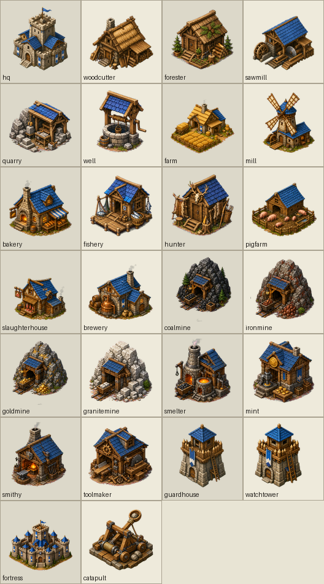
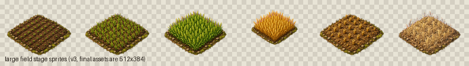
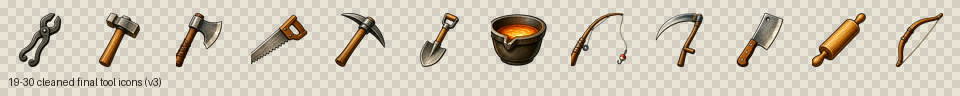

# Grenzmark

Grenzmark ist ein Godot-4-Aufbauspiel im Geist von **Die Siedler II**,
**Return to the Roots** und **Widelands**. Ziel ist nicht ein 1:1-Klon, sondern
eine eigene, frei austauschbare Neuimplementierung der klassischen Spielmechanik:
Warenkreisläufe, Flaggen, Straßen, Träger, Baustellen, Produktionsketten,
Grenzen, Soldaten, KI und später eine deterministische Multiplayer-Basis.

**Wichtig:** Es werden keine originalen Spiel-Dateien, Grafiken, Daten oder
Codeabschnitte aus den Vorbildern verwendet. Konzepte als Inspiration sind okay,
kopierte geschützte Inhalte nicht.

## 100 % KI-Projekt

Grenzmark ist bewusst als Experiment angelegt: **Code und möglichst auch Assets
entstehen zu 100 % durch KI-Agenten.** Menschen testen, geben Feedback und setzen
die Richtung, schreiben aber nicht selbst am Projekt mit. Die Entwicklung wird
teilweise live begleitet:

- Twitch: [twitch.tv/jobbedeluxe](https://www.twitch.tv/jobbedeluxe)
- Hauptrepo: [github.com/JobbeDeluxe/grenzmark](https://github.com/JobbeDeluxe/grenzmark)
- Agenten-Regeln: [AGENTS.md](AGENTS.md)

Pull Requests sollen angeben, welches KI-Modell oder welcher Agent die Änderung
erstellt hat.

## Eindruck

Die folgenden Bilder zeigen aktuelle austauschbare Asset- und Design-Previews.
Im Spiel werden die eigentlichen PNGs aus den Asset-Ordnern geladen; fehlen
Dateien, zeichnet Godot vorläufige Platzhalter.

<p align="center">
  
  
</p>
<p align="center">
  
  
</p>

## Aktueller Stand

Grenzmark ist ein spielbarer Prototyp mit klar getrenntem Simulationskern und
Godot-Darstellung.

- **Engine:** Godot 4.6.3, GDScript.
- **Architektur:** `core/` enthält die reine, deterministische Simulation;
  `game/` enthält Rendering, Eingabe und UI.
- **Simulation:** feste 30-Hz-Ticks, Tests laufen headless ohne Szenenbaum.
- **Karte:** versetztes Dreiecks-/Hex-Gitter mit sechs Nachbarn, Höhen,
  Terrain-Dreiecken, Bäumen, Steinen, Erzen und endlichen Fischgründen.
- **Bauen:** Bauplätze, Flaggen, Straßen, Bauhilfe, Abriss, Baustellen,
  Materiallieferung und zweistufiger Ausbau.
- **Wirtschaft:** Hauptquartier, zusätzliche Lagerhäuser, Warenbestand,
  Träger, Wegefindung, Produktionsketten, Werkzeuge, Arbeiter und Personenlogik.
- **Produktion:** Holz, Bretter, Stein, Nahrung, Werkzeugketten, Landwirtschaft
  mit Feldphasen von Saat bis Ernte oder Verfall.
- **Militär:** Territorium, Militärgebäude, Soldaten, Angriff, Eroberung,
  Katapult-Logik, einfache Gegner-KI und KI-Plugin-Schnittstelle.
- **UI:** Hauptmenü, untere Hauptleiste, Baumenü, Inventar, Gebäudefenster,
  Minimap, Nebel/Bauhilfe, Einstellungen und Design-Editor.
- **Assets:** austauschbare PNGs plus `assets/design.json`, `assets/tuning.json`
  und `assets/ui.json` für Größen, Positionen, Tuning und UI-Skin.

Details und offene Punkte stehen in [ROADMAP.md](ROADMAP.md). Bekannte Fehler
stehen in [KNOWN_BUGS.txt](KNOWN_BUGS.txt).

## Noch offen

Die größten nächsten Baustellen sind:

- UI-Ausbau und Bedienkomfort in Stufe 8 der Roadmap.
- Vollständige Sprite-Sheets für Träger, Arbeiter, Bauarbeiter und Soldaten.
- Soldaten-Rang-Grafiken und bessere Bewegungsanimationen.
- Mehr Missionen, Kartengenerator-Optionen und Spielziele.
- Sound, Musik, zusätzliche Sprachen und Multiplayer-Vorbereitung.
- Weitere Tests für Randfälle in Wirtschaft, Militär und KI.

## Starten

Godot-Binaries werden nicht ins Repo eingecheckt. Lade Godot 4.6.3 stable von
der offiziellen Godot-Seite und öffne diesen Ordner als Projekt.

Empfohlene lokale Dateinamen:

```text
Godot_v4.6.3-stable_win64.exe
Godot_v4.6.3-stable_win64_console.exe
```

Start aus Godot: Projekt öffnen und `F5` drücken.

Start aus PowerShell, wenn die Godot-Exe im Projektordner liegt:

```powershell
.\Godot_v4.6.3-stable_win64.exe --path .
```

## Tests

Headless-Core-Test:

```powershell
.\Godot_v4.6.3-stable_win64_console.exe --headless --path . --script res://tests/test_core.gd
```

Aktueller erwarteter Stand:

```text
== Ergebnis: 735 ok, 0 fehlgeschlagen ==
```

Die Zahl steigt, wenn neue Tests dazukommen.

## Steuerung

| Eingabe | Aktion |
|---|---|
| Rechte oder mittlere Maustaste ziehen | Karte verschieben |
| Mausrad | Zoomen |
| Linksklick | Aktuelle Aktion ausführen oder Objekt auswählen |
| Untere Leiste / Baumenü | Bau- und Spielmodus wählen |
| `1` / `2` / `9` / `0` | Flagge / Straße / Abriss / Auswahl |
| `Leertaste` | Bauplätze, Flaggen und Straßenhilfe anzeigen |
| `F` | Nebelanzeige umschalten |
| `K` | Gegner-KI ein- oder ausschalten |
| `J` | Gegner-KI wechseln |
| `P` | Produktion des ausgewählten Gebäudes pausieren |
| `S` | Einstellungen öffnen |
| `F2` / `F3` | Speichern / Laden |
| `F5` | Neues Spiel |
| `Pause` | Simulation pausieren |
| `+` / `-` | Simulation schneller / langsamer |
| Minimap-Klick | Kamera zentrieren |

## Assets und Anpassung

Das Spiel lädt PNGs aus `assets/` und fällt sonst auf Platzhalter zurück. So kann
das Aussehen ohne Codeänderung ersetzt werden.

Wichtige Orte:

- `assets/terrain/` - Terrain-Kacheln wie Wasser, Wiese, Berg, Sand und Sumpf.
- `assets/roads/` - Straßen- und Pflastervarianten.
- `assets/buildings/` - Gebäudesprites passend zu den Gebäude-Definitionen.
- `assets/objects/` - Bäume, Steine, Erz und andere Kartenobjekte.
- `assets/goods/` - Waren-Icons passend zu `core/goods.gd`.
- `assets/units/` - optionale Sprite-Sheets für Einheiten.
- `assets/ui/` - UI-Skin, Menühintergrund und Steuerelemente.
- `assets/designs/` - Design-Entwürfe, Kontaktbögen und Asset-Vorlagen.

Der Design-Editor im Spiel schreibt Maße, Eingänge und Positionen nach
`assets/design.json`. Tuning-Werte liegen in `assets/tuning.json`, UI-Werte in
`assets/ui.json`.

Genauere Asset-Regeln stehen in [assets/README.md](assets/README.md).

## Mitmachen

Willkommen sind vor allem Tests, Feedback, Bugberichte, Balancing-Ideen und
KI-erstellte Pull Requests. Vor Änderungen bitte lesen:

- [AGENTS.md](AGENTS.md) - Arbeitsregeln für KI-Agenten.
- [ROADMAP.md](ROADMAP.md) - aktueller Plan und Feature-Lücken.
- [KNOWN_BUGS.txt](KNOWN_BUGS.txt) - bekannte Probleme.
- [assets/README.md](assets/README.md) - Asset-Formate und rechtliche Hinweise.

Bitte keine proprietären Dateien, keine Originalgrafiken und keine kopierten
Codeabschnitte aus kommerziellen Spielen oder fremden Projekten einreichen.

## Lizenz

Code und enthaltene eigene oder generierte Projektassets stehen unter der
MIT-Lizenz, sofern eine Datei nichts anderes sagt. Siehe [LICENSE](LICENSE) und
[NOTICE.md](NOTICE.md).
